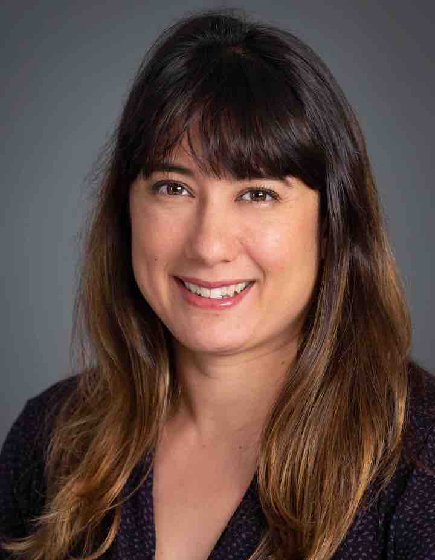

 
Professor Nicole Adelstein has a Ph.D. in Materials Science and Engineering from UC Berkeley. Her undergraduate BA degree was in Interdisciplinary Chemistry and Physics from Reed College. She was at Lawrence Livermore National Laboratory for three years as a postdoc until starting at San Francisco State University (SFSU).  

The Adelstein Research Group seeks to understand and improve materials for electrochemical technologies, with a focus on Li-ion batteries. We study atomic-scale processes, such as diffusion, in battery materials, using first-principles (quantum mechanics) simulations.

## Current Members ##
* Anastasia Ovchinnikov (since S22)
* Janet Zhen (since F22, with Jingjing Qiu)
* Ginzu Fung (since S22, with Jingjing Qiu)
* Salma Ahmed (since F20)
* Oskar Garcia (since S20)

## Former Members ##
* Myco Torres (F22)
* Johana Aleman (S20)
* Michael Coates (F20-F21)
* Tracy Nguyen (S20)
* Allysa Ta (S20-F21)
* Kiana Amaral (S20-F21)
* Elisa Vaezazizi (S20-F21)
* Jazmin Velazquez (S20-F21)
* Nathan Le (S20)
* Clarence Olero (F19-)
* Ellen (S19-)
* Eduardo Lopez (S19-)
* Samantha Ocampo (F18-)
* Jocelyn Bonilla-Araujo (F18-)
* Vanessa Wei (F17-)
* Michael Ward (F17-)
* Vincent Aguirre (F17-)
* Alex T. Hall (S17-)
* Andrew Grieder (S17-)
* Zerina Mehmedovic (S17-)
* Nima Leclerc (F16-)
* Thomaz Alves (S16-)
* Alysia Zevgolis (F15-)

## Summer Students ##
* Yuly Cruz(PSP23)
* Steven Jue (PSP23)
* Laurence To (PSP23)
* Amando Nudo (PSS23)

